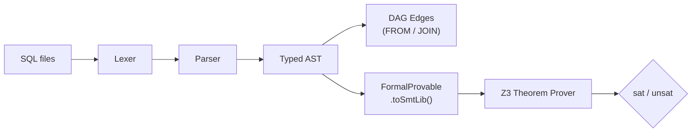

<div align="center">

<br/>

# Ancycle

**Formal verification for data pipelines.**

[](LICENSE)
[](https://bun.sh)
[](https://github.com/Z3Prover/z3)
[](#)

</div>

---

Ancycle reads your SQL, builds a constraint model of your pipeline, and feeds it to a local Z3 theorem prover. If your DAG has a logical contradiction, Ancycle tells you before anything runs.

No YAML. No runtime. No compute bill.

---

### The problem

Data orchestrators execute first and ask questions later. A pipeline where an upstream node filters `status = 'active'` and a downstream node filters `status = 'churned'` will run to completion, write an empty table, return exit code 0, and silently break every dashboard downstream.

You find out the next morning. Or you don't.

### What Ancycle does

It parses the SQL, extracts the `WHERE` predicates as formal constraints, infers the DAG from the `FROM` and `JOIN` clauses, and checks whether the combined constraint set is satisfiable.

```
$ bun src/cli/demo.ts

🛡️  ANCYCLE
────────────────────────────────────────────────────────────────
  Read [stg_active_users]: Constraints → (= status "active")
  Read [process_churned]:  Depends on  → [stg_active_users]
  Read [process_churned]:  Constraints → (= status "churned")

  Z3 QF_S Resolution: UNSAT

  ↳ [process_churned] is guaranteed to process 0 rows.
    Upstream and downstream filters are mutually exclusive.

  Compute provisioned: $0.00
  Wall time: 0.04s
```

The engine handles real SQL — JOINs, subqueries, aliases, aggregations, CASE expressions, GROUP BY, HAVING, ORDER BY. The parser is handwritten (zero dependencies) and the full test suite runs in 124ms.

---

### How it works

1. A custom recursive-descent parser tokenizes and parses your `.sql` files into a typed AST.
2. AST nodes that participate in filtering implement a `FormalProvable` interface — they know how to translate themselves into SMT-LIB2.
3. The constraint assertions are sent to a local Z3 process. Z3 returns `sat` (the path is logically possible) or `unsat` (the path is dead).

That's it. The code is the DAG. The predicates are the proof.

---

### Quickstart

Requires [Bun](https://bun.sh/) and the [Z3](https://github.com/Z3Prover/z3) binary.

```bash
git clone https://github.com/bneb/ancycle
cd ancycle
bun install
bun test           # 118 tests, 0 failures
bun src/cli/demo.ts
```

---

### Architecture



| Module | Role |
|--------|------|
| `src/parser/lexer.ts` | Zero-dependency character scanner, 30+ SQL token types |
| `src/parser/ast.ts` | Typed AST nodes implementing `FormalProvable` |
| `src/parser/parser.ts` | Recursive descent — JOINs, subqueries, CASE, aggregations |
| `src/parser/sql-parser.ts` | Bridge: SQL → DAG edges + Z3 assertions |
| `src/shadow/z3.ts` | Z3 subprocess driver, QF_S string logic |

Built on the formal execution principles of [b4mal](https://github.com/bneb/b4mal).

---

### Ancycle Cloud (Early Access)

The Ancycle CLI is open-source and perfect for local development. We are currently onboarding design partners for **Ancycle Cloud** — a fully managed control plane with team visibility, CI/CD blocking, and automated scheduling. 

[Join the Waitlist](https://ancycle.com)

