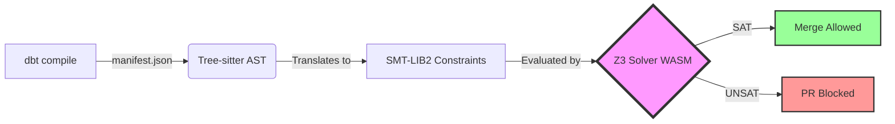

# Ancycle

**Stop merging silent data bugs. Bring Formal Verification to your SQL pipelines.**

[](https://github.com/kevin/ancycle/actions/workflows/ancycle-pr.yml)

Ancycle is a formal verification and static analysis engine for data engineers. By translating your `dbt` models into mathematical constraints, Ancycle uses Microsoft's **Z3 Theorem Prover** to guarantee the absence of logical contradictions across your entire Directed Acyclic Graph (DAG) before your code is ever merged.

## The Silent Data Bug Crisis

In modern data engineering, pipelines are chained together. If an upstream model filters out rows (e.g., `WHERE status = 'active'`), and a downstream model expects that data (e.g., `WHERE status = 'churned'`), the pipeline won't crash. It silently returns zero rows, quietly breaking CEO dashboards and causing massive data incidents.

Existing data tests only run *after* the query is executed in production, costing you thousands of dollars in Snowflake/BigQuery compute just to discover a bug.

Ancycle catches these bugs at **Compile-Time**. 

## How It Works


```mermaid
graph LR
    A[dbt compile] -->|manifest.json| B(Tree-sitter AST)
    B -->|Translates to| C[SMT-LIB2 Constraints]
    C -->|Evaluated by| D{Z3 Solver WASM}
    D -->|SAT| E[Merge Allowed]
    D -->|UNSAT| F[PR Blocked]
    
    style D fill:#f9f,stroke:#333,stroke-width:4px
    style F fill:#f99,stroke:#333,stroke-width:2px
    style E fill:#9f9,stroke:#333,stroke-width:2px
```

Ancycle acts like a type-checker for SQL. It extracts the `WHERE` and `JOIN ON` clauses from your DAG, translates them into Boolean Logic, and asks Z3 if it is mathematically possible for data to flow through the pipeline. If a path is impossible (a contradiction), Ancycle instantly blocks your Pull Request.

## Quickstart (GitHub Actions)

Ancycle requires zero configuration. Just drop this workflow into your repository and we will protect your main branch automatically.

Create `.github/workflows/ancycle.yml`:

```yaml
name: Ancycle Verification

on:
  pull_request:
    branches:
      - main

jobs:
  verify-dag:
    runs-on: ubuntu-latest
    steps:
      - name: Checkout Code
        uses: actions/checkout@v4

      - name: Setup dbt
        uses: dbt-labs/setup-dbt@v1

      - name: Compile dbt Models
        run: dbt compile
        
      - name: Run Ancycle Z3 Verification
        uses: kevin/ancycle@v1
        with:
          manifest_path: 'target/manifest.json'
```

## Features
- **Dialect Agnostic:** Uses `tree-sitter-sql` to gracefully handle BigQuery backticks, Snowflake casts, and Postgres arrays.
- **Stateless Execution:** Runs Z3 via WASM natively in your CI runner. No data leaves your network.
- **Advanced SMT Bounds:** Native support for `NULL` three-valued logic, overlapping Date/Time boundaries (`INTERVAL`, `DATE_ADD`), and advanced string prefix matching (`LIKE`).

## Coming Soon
- Native integration with **Databricks Unity Catalog**.
- Native integration with **Snowflake Native Apps & Snowpark**.

---
*Ancycle: Because your data deserves compiler-level safety.*
